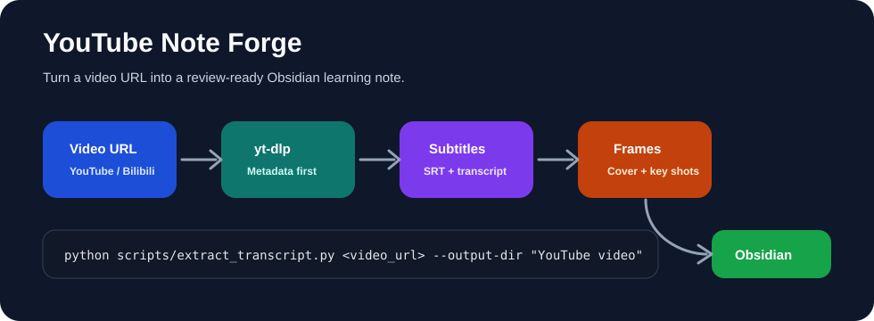
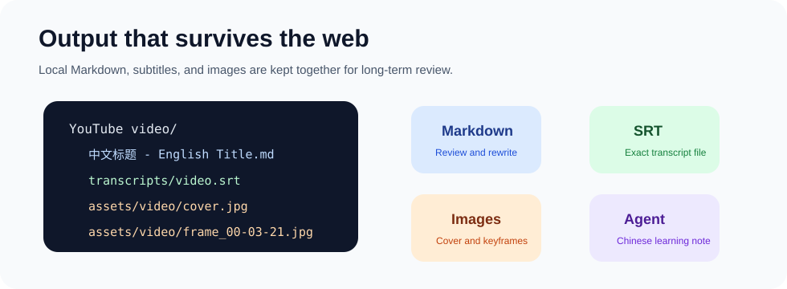

# YouTube Note Forge

Turn long videos into Obsidian-ready learning notes, with transcripts, SRT files, cover images, and useful screenshots.

YouTube Note Forge v3.3.1 is an agent skill for people who do serious learning from video. Paste a YouTube or Bilibili URL, let `yt-dlp` collect the reliable source material, then use the fixed workflow to forge it into a structured Chinese note with transcript-guided visual evidence.



## 中文使用总览

### 它由什么组成

整个产品只有一条视频处理流程，组件职责刻意分开：

```text
Chrome 当前视频页
  -> YouTube 阅读器扩展（读取当前 URL 与 youtube.com Cookie）
  -> 本地桌面伴侣（127.0.0.1:32191）
  -> OpenCode /video-note 命令（固定用户选择的模型）
  -> youtube-transcript Skill（字幕、SRT、抽帧、写作、校验）
  -> Obsidian Vault/YouTube video
```

- **浏览器扩展**只读取当前标签页 URL、把 Cookie 交给本机伴侣，并展示进度和结果；它不分析视频。
- **桌面伴侣**只保存 Cookie、启动 OpenCode、转发进度、停止任务和打开 Obsidian；它不读取字幕、不写文章。
- **OpenCode**提供已配置的大模型，并执行固定 `/video-note` 命令。不同聊天中选择的模型不会改变插件设置中的固定模型。
- **youtube-transcript Skill**是唯一视频工作流，负责元数据、字幕、SRT、封面、定点截图、中文文章和质量校验。
- **Obsidian**只是最终文件存储与阅读工具。生成时不必提前打开；启用自动打开后，完成时桌面伴侣会打开对应笔记。

这样拆分的原因是：浏览器最适合取得登录态 Cookie，本地程序适合启动受控进程，Skill 适合保持跨模型一致的处理规则，Obsidian 适合长期保存本地 Markdown。Cookie 不需要经过云端中转，视频流程也不会因为换一个 OpenCode 聊天模型而改道。

### 一次任务有哪些阶段

| 阶段 | 界面进度 | 实际工作 | 失败行为 |
| --- | ---: | --- | --- |
| Cookie | 0–4% | 从当前 Chrome 会话读取 YouTube Cookie，保存到现有凭据目录 | 读取不到或被 YouTube 拒绝时立即停止 |
| 启动 | 4–8% | 运行固定的 OpenCode `/video-note` 命令 | OpenCode/模型不可用时停止 |
| 素材 | 8–18% | 获取元数据、字幕、SRT 和封面 | 素材总时限 5 分钟，超时停止 |
| 规划 | 18–35% | 根据字幕生成文章章节和对应截图时间点 | 不允许绕过或自行换工具 |
| 截图 | 35–72% | 从最高 720p 流按时间点抽帧，通常 6–14 张 | 最多 2 分钟；失败给出时间点和原因 |
| 写作 | 72–92% | 生成中文学习笔记，把截图放在对应说明附近 | 不重新提取已经成功的素材 |
| 校验 | 92–98% | 检查标题、章节、中文深度、截图、图注、SRT 和链接 | 第一次失败只修笔记一次；第二次失败才终止 |
| 完成 | 100% | 返回笔记路径、照片目录、截图数量和总耗时 | 可复制路径或在 Obsidian 打开 |

端到端硬时限为 8 分钟。弹窗每秒刷新显示状态，桌面伴侣每 5 秒产生一次任务心跳。运行中始终显示视频名称、原始链接、当前阶段、已运行时间和预计保存目录。关闭弹窗、关闭 YouTube 标签页或打开另一个 YouTube 页面都不会终止任务；重新点击扩展会恢复同一个任务。运行中点击 **强制停止** 会终止 OpenCode 进程树；任务已经失败时，同一位置显示 **清除任务**，清除终态后即可开始新视频。

### 需要安装什么

当前版本面向 Windows 10/11，需要以下程序可从命令行找到：

- Chrome：安装本地 MV3 扩展，并提供当前 YouTube 登录态。
- OpenCode：必须已配置至少一个可用模型；朋友使用时也需要安装 OpenCode 并配置自己的模型凭据。
- Obsidian：用于阅读最终笔记；运行生成任务时可以关闭。
- Python 3.10 或更高版本：运行 Skill，安装 `requirements.txt` 中的 `yt-dlp`、Pillow、NumPy 和 FFmpeg 绑定。
- FFmpeg：定点读取 720p 分片并保存 JPEG。
- Node.js：供 `yt-dlp` 处理部分站点 JavaScript challenge。

可选的本地 ASR 依赖在 `requirements-asr.txt`，默认关闭；只有用户明确允许 ASR 时才会下载音频。正常字幕与截图流程不会下载完整视频。远程定点截图失败时，只允许下载目标附近约 8 秒的临时片段，成功后立即删除。

### 安装步骤

在仓库根目录 `E:\opai\youtube video analysis` 打开 PowerShell：

```powershell
powershell -ExecutionPolicy Bypass -File .\scripts\install.ps1
```

安装脚本会同步 Skill 到 OpenCode 与 Obsidian、安装 Python 依赖、构建桌面伴侣、注册 Windows 登录启动项并启动本地服务。安装后的程序位于：

```text
%LOCALAPPDATA%\YouTubeNoteReader\youtube_reader_host.py
```

Chrome 仍需一次手动加载：

1. 打开 `chrome://extensions`。
2. 开启右上角“开发者模式”。
3. 点击“加载已解压的扩展程序”。
4. 选择 `E:\opai\youtube video analysis\extension`。
5. 打开扩展设置，选择 OpenCode 模型，确认 Obsidian Vault 路径并保存。

桌面伴侣未启动时，先运行：

```powershell
powershell -ExecutionPolicy Bypass -File .\scripts\restart_companion.ps1
```

如果该脚本提示尚未安装，再运行 `install.ps1`。随后在扩展弹窗点击 **重试连接**，不需要重新加载整个 Chrome。

### 怎么使用与查找结果

1. 在 Chrome 打开一个 YouTube 视频并保持账号已登录。
2. 点击工具栏中的红色书本播放图标。
3. 点击 **生成学习笔记**。
4. 等待阶段进度到 100%；需要中止时点击 **强制停止**。
5. 完成页会显示并可复制两个绝对路径：**文件位置**和**照片位置**。启用自动打开时，Obsidian 会直接打开最终笔记。

默认输出结构：

```text
C:\Users\win11\Documents\Obsidian Vault\YouTube video\
├── 中文标题 - English Title.md
├── transcripts\
│   └── 待命名 - Original English Title.srt
└── assets\VIDEO_ID\
    ├── frame-manifest-<计划指纹>.json
    ├── frame_01_00-00-28.jpg
    ├── frame_02_00-00-54.jpg
    └── ...
```

笔记正文包含一句话摘要、核心知识点、详细内容、重点难点、可视化总结、学习图谱、行动建议、术语表和 SRT 链接。正文截图既支持 Obsidian `![[图片]]`，也支持标准 Markdown ``；两种写法都会经过真实文件与抽帧清单校验。

### 失败与恢复

- **本地桌面伴侣未启动**：运行 `scripts\restart_companion.ps1`；未安装则运行 `scripts\install.ps1`。Host 文件路径是 `%LOCALAPPDATA%\YouTubeNoteReader\youtube_reader_host.py`，由 Python 的无窗口启动器 `pythonw.exe` 后台运行，避免未签名 EXE 被 Windows Application Control 拦截。
- **任务看似卡住**：先看阶段与运行秒数；如果 5 秒以上完全没有心跳，可点击强制停止。旧任务退出后可以立即开始新视频。
- **Cookie 失效**：保持当前 YouTube 页面已登录并重新点击生成。扩展会自动覆盖旧 Cookie，不需要手工粘贴。
- **第一次笔记校验失败**：系统只修改当前笔记一次，不重跑字幕和截图。只有第二次仍失败才报告 `NOTE_VALIDATION_FAILED`。
- **没有截图**：任务不会进入正式完成状态；读取错误码确认是 Cookie、网络、低清画面还是覆盖不足。
- **关闭了弹窗**：任务仍在桌面伴侣运行；从任意 YouTube 页面重新打开扩展即可恢复进度。

验证安装：

```powershell
powershell -ExecutionPolicy Bypass -File .\scripts\verify_install.ps1
```

卸载：

```powershell
powershell -ExecutionPolicy Bypass -File .\scripts\uninstall.ps1
```

### 分享给朋友

当前架构依赖本地 OpenCode，所以朋友也需要安装 OpenCode、Obsidian、运行 `install.ps1`，并使用自己的模型 API Key。这样做的优势是 Cookie、视频素材和笔记全部留在朋友自己的电脑上，没有中心服务器费用，也不需要把 YouTube 登录态交给第三方。若以后要做到“只装一个扩展即可分享”，需要增加托管后端或把模型运行时打包进桌面应用，这会引入服务器成本、账号体系和 Cookie 安全责任，不属于当前轻量本地版。

## Why Star This

- Built for video learners, not just transcript dumping.
- Produces Markdown notes, SRT subtitles, covers, and transcript-guided keyframes in a bounded workflow.
- Keeps cookies in a shared credentials folder and backs up last-known-good cookies.
- Fails fast instead of quietly opening random browser automation fallbacks.
- Designed for Obsidian workflows: clean filenames, local assets, and review-ready note sections.

## What It Does

1. Reads metadata with `yt-dlp`.
2. Prefers platform subtitles and saves them as `.srt`.
3. Optionally falls back to local ASR with `faster-whisper`.
4. Extracts a cover first; then maps planned timestamps directly to bounded 720p HLS media segments. If that path is unavailable, it downloads only bounded 8-second temporary segments, never the whole video.
5. Validates the finished Chinese learning note and stops after one bounded repair attempt.



## Install

Clone this repo into your skill directory:

```bash
cd ~/.codex/skills
git clone https://github.com/yinbaozong/Youtube-note-forge.git
```

For OpenCode-style skill locations, clone it to:

```bash
mkdir -p ~/.config/opencode/skills
cd ~/.config/opencode/skills
git clone https://github.com/yinbaozong/Youtube-note-forge.git youtube-transcript
```

Install runtime dependencies:

```bash
python -m pip install -r requirements.txt
node --version
```

If `node --version` fails, install Node.js first. `yt-dlp` uses Node for some site JavaScript challenges.

Optional ASR fallback:

```bash
python -m pip install -r requirements-asr.txt
```

Verify the local installation before touching YouTube or Bilibili:

```bash
python scripts/extract_transcript.py --self-test --vault ./_verify --output-dir notes
```

If this succeeds, your Python dependencies and Markdown/SRT generation path are working. Real video extraction can still require platform access or valid cookies.

## Chrome Extension

The local YouTube Reader extension reads the current YouTube URL and its `.youtube.com` cookies, then talks to a desktop companion bound only to `127.0.0.1:32191`. The companion starts the existing `/video-note` OpenCode command. Neither component analyzes video or writes notes, and cookie values are never stored in Chrome extension storage.

Install the Skill and desktop companion:

```powershell
powershell -ExecutionPolicy Bypass -File .\scripts\install.ps1
```

Chrome requires one manual step for a local unpacked extension:

1. Open `chrome://extensions`.
2. Enable **Developer mode**.
3. Choose **Load unpacked**.
4. Select the repository's `extension` directory.
5. Open the extension settings, select an OpenCode model, optionally enter that provider's API key, and save.

The API key is passed directly to the local companion and stored with OpenCode's existing credentials. Cookie values are sent only over the local loopback connection and saved at the existing `cookies.youtube.txt` path. Obsidian does not need to be open while a job runs. Closing the popup never stops the desktop job; reopening the extension from any YouTube tab reconnects to the same request. The extension badge shows progress or completion, and the finished popup shows the full note path, screenshot count, total runtime, a copy-path action, and an **Open in Obsidian** button. Auto-open is enabled by default and is executed by the desktop companion, so it still works when the popup is closed. A visible **Force stop** button terminates the OpenCode process tree without deleting completed files.

The visible stages are: Cookie sync, OpenCode startup, source material extraction, article and screenshot planning, bounded frame extraction, Chinese note writing, quality validation, and completion. A failed stage returns its machine error code and stops; it does not switch browsers or retry with a different workflow.

Verify or remove the local bridge:

```powershell
powershell -ExecutionPolicy Bypass -File .\scripts\verify_install.ps1
powershell -ExecutionPolicy Bypass -File .\scripts\uninstall.ps1
```

## Need Help?

If you want to reproduce this project but are not sure how to start, feel free to contact me anytime: yinbaozong@163.com

## First Run

Run from your Obsidian vault root:

```bash
python .obsidian/skills/youtube-transcript/scripts/extract_transcript.py "https://www.youtube.com/watch?v=VIDEO_ID" --output-dir "YouTube video" --deadline 300
```

Typical output:

```text
YouTube video/
├── 待命名 - Example Video.md
├── transcripts/
│   └── 待命名 - Example Video.srt
└── assets/
    └── 待命名 - Example Video/
        ├── cover.jpg
        └── frame_00-03-21.jpg
```

Then use the fixed OpenCode command:

```text
/video-note <video url>
```

## Cookies

Public videos usually work without cookies. If a platform asks for login, export cookies manually and save them here:

```text
~/.config/opencode/credentials/youtube-transcript/cookies.youtube.txt
~/.config/opencode/credentials/youtube-transcript/cookies.bilibili.txt
```

Rules baked into the skill:

- YouTube cookies are never reused for Bilibili.
- Bilibili cookies are never reused for YouTube.
- A working cookie is copied to `*.lastgood`.
- If a command fails after mutating a cookie file, the script restores the pre-run cookie.
- The skill asks for fresh cookies only after the saved cookie is actually rejected.

## Common Commands

Check the installed version:

```bash
python .obsidian/skills/youtube-transcript/scripts/extract_transcript.py --version
```

Extract screenshots from a transcript-guided plan:

```bash
python .obsidian/skills/youtube-transcript/scripts/extract_frames.py <video_url> --plan frame-plan.json --note "YouTube video/待命名 - Video.md" --deadline 120
```

Allow local ASR when subtitles are missing:

```bash
python .obsidian/skills/youtube-transcript/scripts/extract_transcript.py <video_url> --output-dir "YouTube video" --allow-asr --asr-model base
```

Use a proxy:

```bash
python .obsidian/skills/youtube-transcript/scripts/extract_transcript.py <video_url> --proxy http://127.0.0.1:7897
```

## Troubleshooting

- `yt-dlp` errors: run `python -m pip install --upgrade "yt-dlp[default]"`.
- No subtitles: retry with `--allow-asr`, or choose another video with captions.
- No screenshots: read the `PIPELINE_RESULT` from `extract_frames.py`; it stops on missing required evidence or insufficient coverage.
- Bilibili `HTTP 412`: add a Bilibili cookie once; if it continues, report the 412 instead of repeatedly replacing cookies.
- YouTube login challenge: export a fresh YouTube cookie and save it as `cookies.youtube.txt`.

## Philosophy

This skill is intentionally boring where reliability matters. It does not silently launch Puppeteer, Chrome for Testing, browser audio recording, or a second downloader. If extraction fails, it emits a fixed error result and stops.
